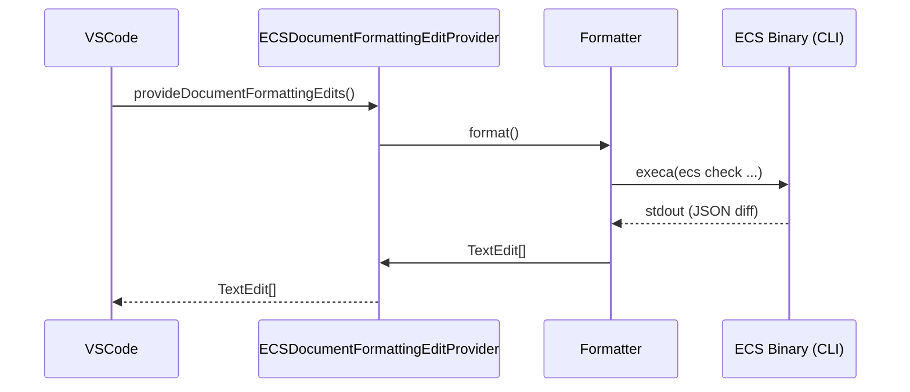

# Contributing

このプロジェクトのセットアップと開発手順について。

## アーキテクチャ

VS Code の `DocumentFormattingEditProvider` API を通じて ECS を統合しています。



## 前提条件

- **Node.js**: v18以上
- **PHP**: (E2Eテストの実行に必要)

## セットアップ

1. **リポジトリのクローン:**
   ```bash
   git clone https://github.com/picopicos/easy-coding-standard-vscode.git
   cd easy-coding-standard-vscode
   ```

2. **依存関係のインストール:**
   ```bash
   npm install
   ```

## 開発

- **デバッグ**: プロジェクトを VS Code で開き、**F5** キーを押してデバッグ実行（Extension Development Host）を開始します。
- **ビルド**: `npm run compile`
- **パッケージング**: `npm run package` を実行して `.vsix` ファイルを生成します。VS Code の拡張機能ビューの「VSIX からのインストール...」から手動でインストールできます。

## テストと品質保証

| 種類 | コマンド | 説明 |
|---|---|---|
| **Unit Tests** | `npm test` | [Vitest](https://vitest.dev/) によるロジック検証。 |
| **E2E Tests** | `npm run test:e2e` | [@vscode/test-cli](https://github.com/microsoft/vscode-test-cli) による VS Code E2Eテスト。 |
| **Lint / Format** | `npm run format` | [Biome](https://biomejs.dev/) によるコード整形と静的解析。 |

## ローカリゼーション (l10n)

1. **UI文字列**: `l10n/bundle.l10n.json` (英語) と `l10n/bundle.l10n.ja.json` (日本語) を更新します。
2. **ドキュメント**: `README.md` と `README.ja.md` を同期させます。

## リリースプロセス

GitHub Actions によって自動化されています。

1. **バージョン更新**: `npm version patch` (または minor/major)
2. **プッシュ**: `git push && git push --tags`
