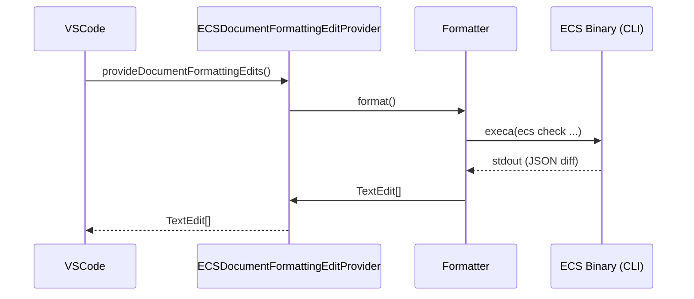

# Contributing

This document outlines the setup and development process for the extension.

## Architecture

The extension integrates ECS via VS Code's `DocumentFormattingEditProvider` API.



## Prerequisites

- **Node.js**: v18+
- **PHP**: (Required for integration tests)

## Setup

1. **Clone the repository:**
   ```bash
   git clone https://github.com/picopicos/easy-coding-standard-vscode.git
   cd easy-coding-standard-vscode
   ```

2. **Install dependencies:**
   ```bash
   npm install
   ```

## Development

- **Debugging**: Open the project in VS Code and press **F5** to launch the Extension Development Host.
- **Build**: `npm run compile`
- **Packaging**: Run `npm run package` to generate a `.vsix` file. You can install it manually via the "Install from VSIX..." option in the VS Code Extensions view.

## Testing & Quality

| Type | Command | Description |
|---|---|---|
| **Unit Tests** | `npm test` | Logic verification using [Vitest](https://vitest.dev/). |
| **E2E Tests** | `npm run test:e2e` | VS Code integration tests via [@vscode/test-cli](https://github.com/microsoft/vscode-test-cli). |
| **Lint / Format** | `npm run format` | Code style enforcement using [Biome](https://biomejs.dev/). |

## Localization (l10n)

1. **UI Strings**: Update `l10n/bundle.l10n.json` (English) and `l10n/bundle.l10n.ja.json` (Japanese).
2. **Documentation**: Keep `README.md` and `README.ja.md` synchronized.

## Release Process

Releases are automated via GitHub Actions on tag push.

1. **Bump Version**: `npm version patch` (or minor/major)
2. **Push**: `git push && git push --tags`
